# Abisena — Hasta Takip Sistemi

Poliklinik hasta randevu ve takip paneli. Abisena / Panates teknik değerlendirme case study projesi.

## Ekran Görüntüleri

Uygulamanın arayüzü aşağıda özetlenmiştir. Tüm görseller [`screenshots/`](screenshots/) klasöründedir.

### Ana panel (masaüstü)

İstatistik kartları, arama/filtre alanı ve hasta tablosu. Türkçe ve İngilizce dil desteği; aydınlık ve karanlık tema.

| Aydınlık (TR) | Karanlık (TR) |
|:---:|:---:|
|  | 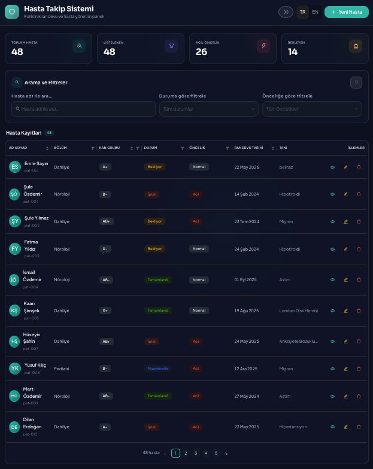 |

| Aydınlık (EN) | Karanlık (EN) |
|:---:|:---:|
| 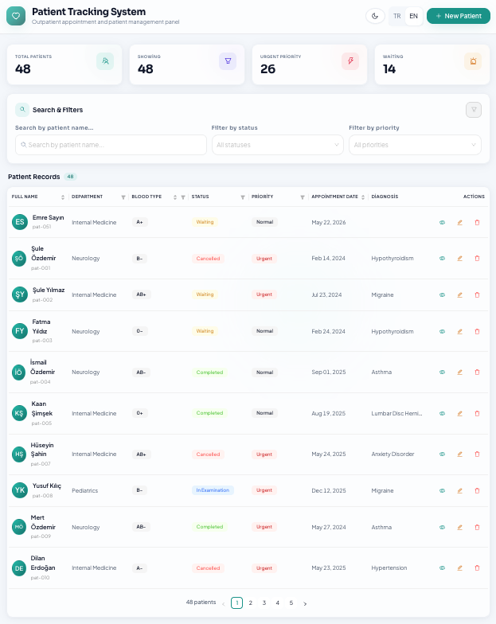 | 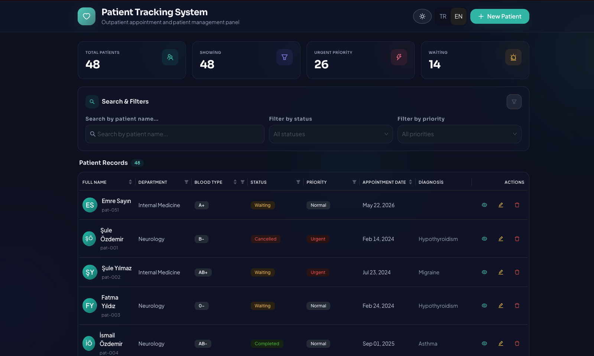 |

### Hasta işlemleri (CRUD)

Yeni hasta ekleme, düzenleme, detay görüntüleme ve silme onayı modalları.

| Yeni hasta (aydınlık) | Yeni hasta (karanlık) |
|:---:|:---:|
| 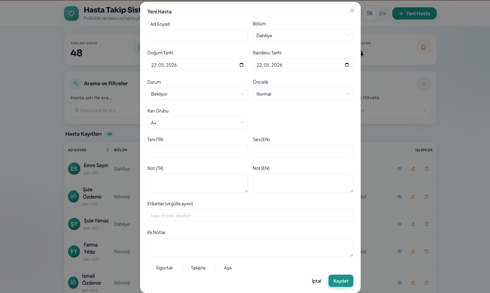 | 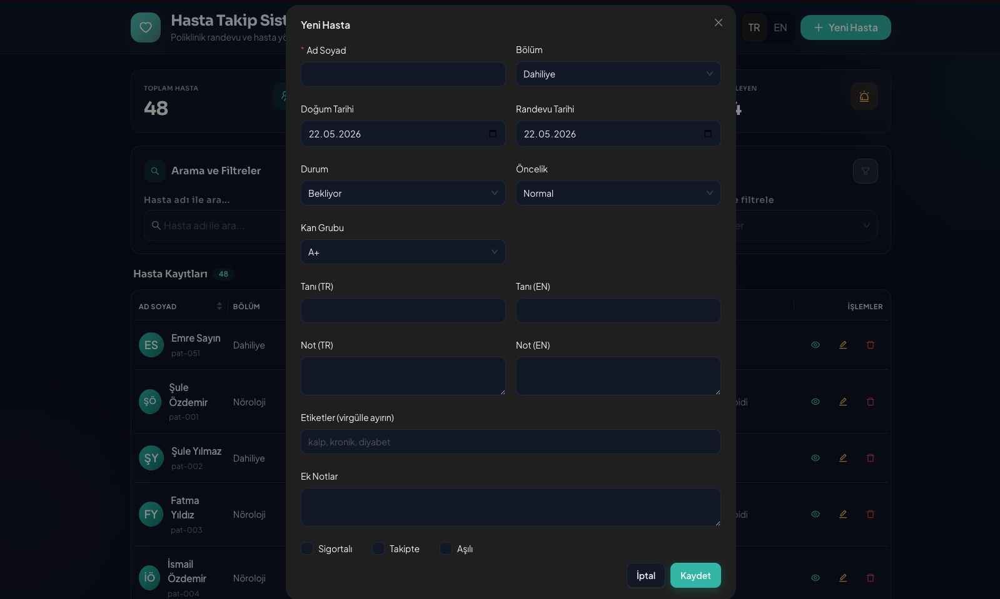 |

| Hastayı düzenle (aydınlık) | Hastayı düzenle (karanlık) |
|:---:|:---:|
| 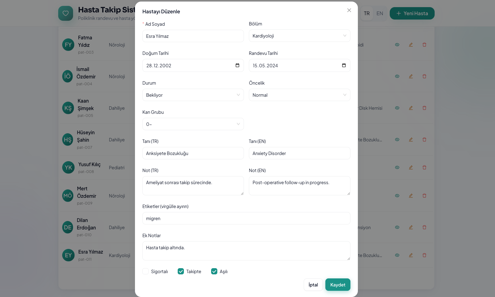 | 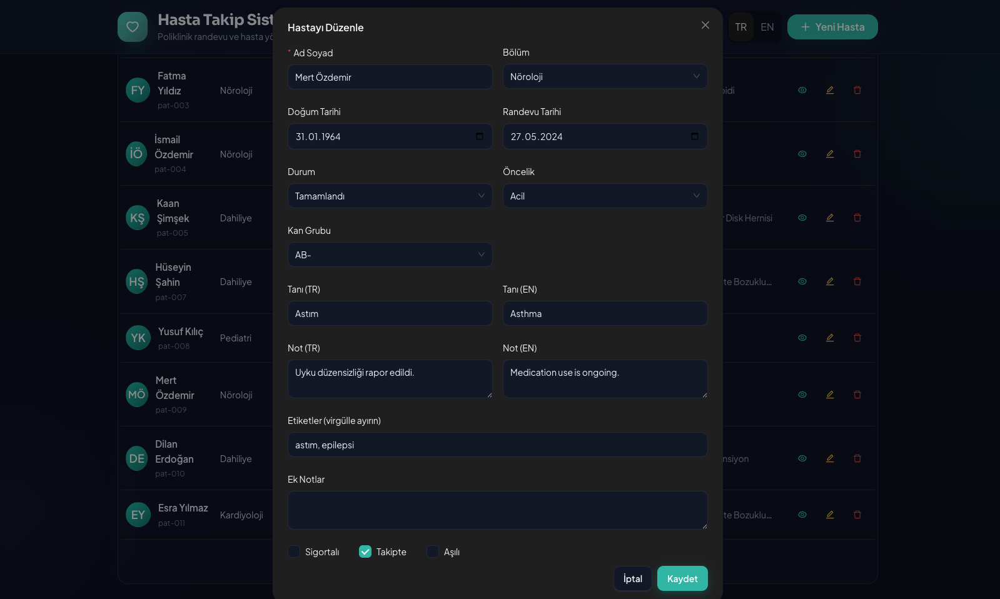 |

| Hasta detayı (aydınlık) | Hasta detayı (karanlık) |
|:---:|:---:|
| 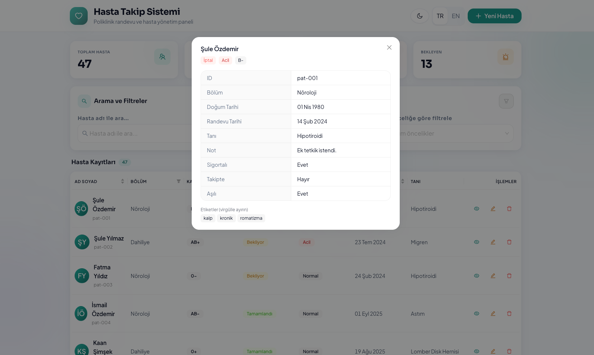 | 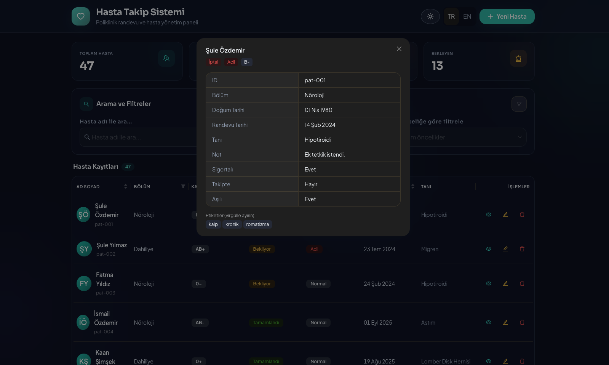 |

| Silme onayı |
|:---:|
| 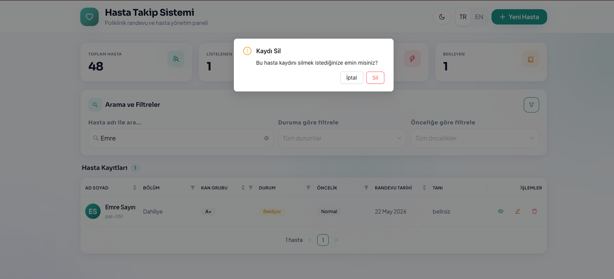 |

### Arama ve filtreleme

Hasta adına göre arama; sonuç bulunduğunda istatistik kartları ve tablo güncellenir. Eşleşme yoksa boş durum mesajı gösterilir.

| Aktif arama | Boş sonuç |
|:---:|:---:|
| 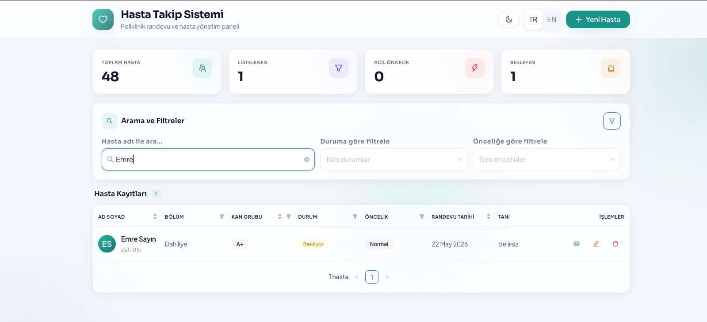 | 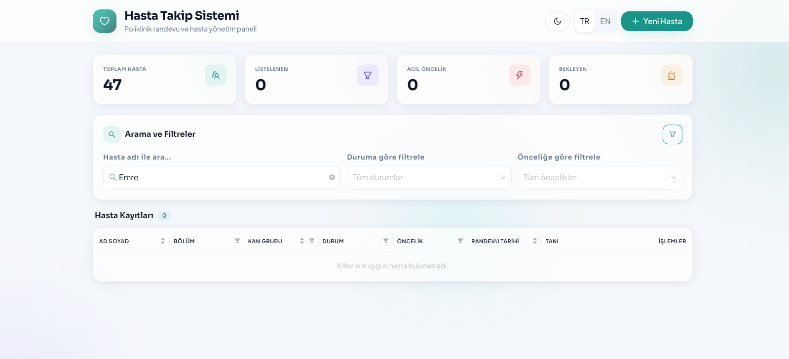 |

Filtreler URL sorgu parametrelerine yazılır (`q`, `status`, `priority`); sayfa yenilense veya link paylaşılsa filtreler korunur.

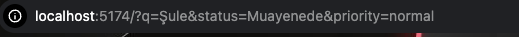

### Mobil görünüm

Dar ekranlarda tablo yerine accordion liste; kart genişletildiğinde detaylar ve işlem butonları görünür.

| Mobil panel (aydınlık) | Mobil panel (karanlık) |
|:---:|:---:|
| 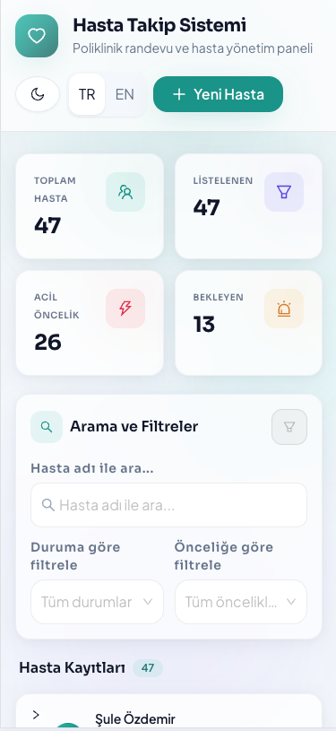 | 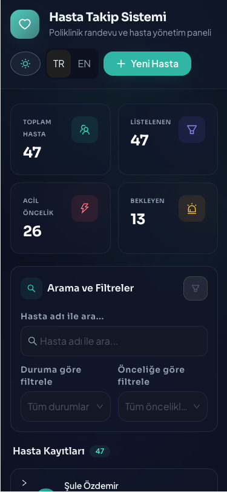 |

| Accordion liste | Accordion — genişletilmiş (aydınlık) |
|:---:|:---:|
| 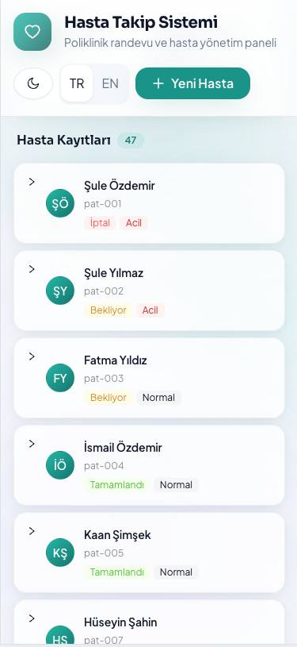 | 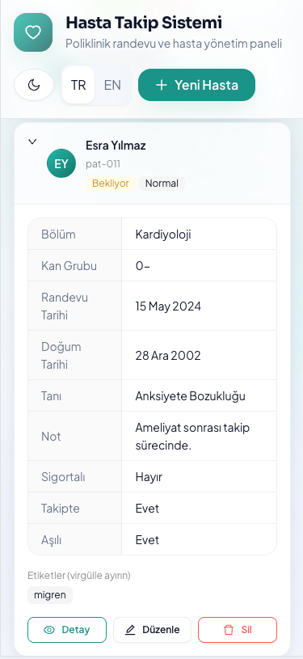 |

| Accordion — genişletilmiş (karanlık) | Mobil detay modalı |
|:---:|:---:|
| 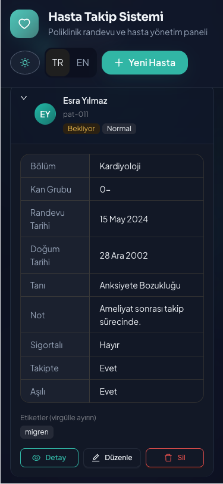 | 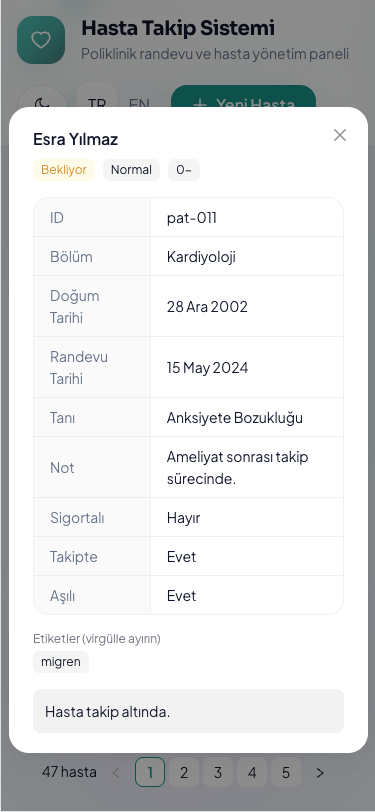 |

### Veri kalıcılığı (localStorage)

Ekleme, düzenleme ve silme işlemleri tarayıcıda saklanır; tema ve dil tercihleri de kalıcıdır.

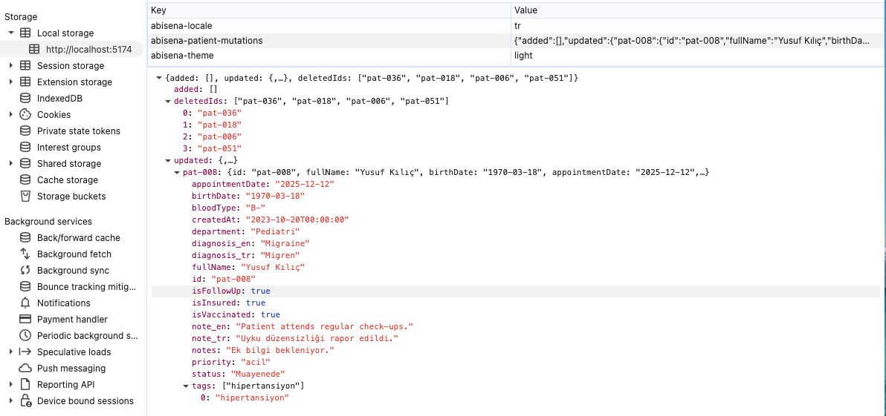

---

## Tech Stack

- **React 18** (Vite — Next.js kullanılmaz)
- **TypeScript**
- **Ant Design 6** (tablo, form, modal, filtreler, dark mode)
- **Redux Toolkit** (tema, dil, hasta state)
- **react-hot-toast** (işlem bildirimleri)
- **Tailwind CSS** (layout yardımcıları)

## Özellikler

| Özellik | Açıklama |
|---------|----------|
| Listeleme | Hasta kayıtları API'den GET ile çekilir |
| Ekleme | API yok — yeni kayıtlar local state'e eklenir |
| Düzenleme | Local state üzerinde güncellenir |
| Silme | Local state üzerinden silinir |
| Arama | Hasta adına göre metin araması |
| Filtreleme | Durum ve önceliğe göre filtre |
| Sıralama | Tablo sütunlarından (ad, randevu, kan grubu) |
| Sütun filtreleri | Bölüm, kan grubu, durum, öncelik |
| Sayfalama | Sayfa başına 10 kayıt |
| Mobil | Accordion liste görünümü |
| Dark mode | Aydınlık / karanlık tema |
| Dil | TR / EN arayüz desteği |
| Kalıcılık | Ekleme/düzenleme/silme localStorage'da saklanır |
| Bildirim | Başarılı işlemlerde sağ üst toast |

## API

```
GET https://v0-json-api-three.vercel.app/api/data
```

## Kurulum

```bash
yarn install
yarn dev
```

Uygulama varsayılan olarak `http://localhost:5173` adresinde çalışır.

## Production Build

```bash
yarn build
yarn preview
```

## Proje Yapısı

```
src/
├── api/           # API istekleri
├── components/    # UI bileşenleri
├── enums/         # Merkezi enum tanımları
├── hooks/         # useLanguage, useTheme, useFilterQueryParams
├── i18n/          # Çeviriler (TR/EN)
├── services/      # localStorage hasta mutasyonları
├── store/         # Redux Toolkit slices
├── types/         # PatientRecord tip tanımları
└── utils/         # Filtre, sıralama, yardımcılar
screenshots/       # README ekran görüntüleri
```

## Veri Modeli — PatientRecord

`id`, `fullName`, `birthDate`, `appointmentDate`, `createdAt`, `department`, `status`, `priority`, `bloodType`, `score`, `note_tr`, `note_en`, `diagnosis_tr`, `diagnosis_en`, `isInsured`, `isFollowUp`, `isVaccinated`, `tags`, `notes?`

## Lisans

MIT
